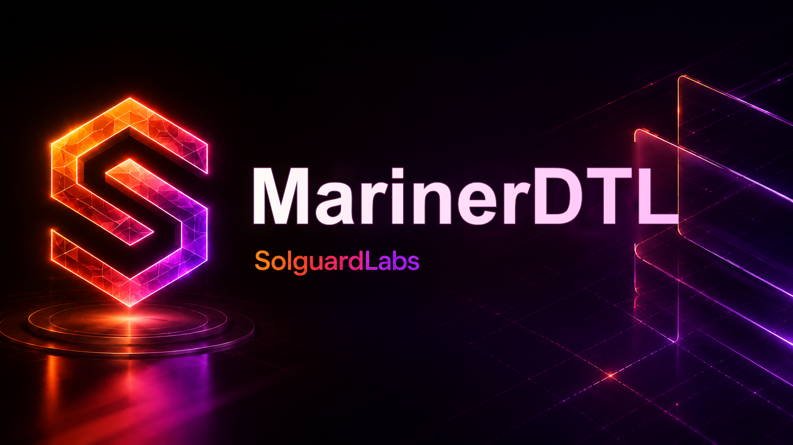

# MarinerDTL



MarinerDTL es un servicio Go de settlement maritimo para rutas de supply-chain
DTL. El motor coordina escrows por ruta, hitos logisticos, custodios,
certificados de entrega, disputas operativas, liberaciones de pago,
penalizaciones y rebates comerciales asociados a corredores.

El repositorio esta disenado para auditoria de logica economica. Los escenarios
JSON producen reportes deterministas y los tests TypeScript ejecutan el binario
Go como lo haria una mesa de operaciones o un integrador de backoffice.

## Componentes

- `src/domain`: entidades de cuentas, rutas, hitos, custodios y reportes.
- `src/ledger`: journal contable y movimientos de escrow, rebates y penalties.
- `src/policy`: parametros economicos, limites y admision de operaciones.
- `src/custody`: validacion de custodios y certificados de entrega.
- `src/settlement`: calculos de progreso, cancelacion, disputas y rebates.
- `src/engine`: servicio de aplicacion y comandos de negocio.
- `src/scenario`: runner determinista para fixtures JSON.
- `src/api`: handlers HTTP opcionales para ejecucion local.

## Requisitos

- Go 1.22 o superior.
- Node.js 22 o superior.
- npm 10 o superior.
- Bash para scripts de CI local.

## Uso

Instalar dependencias de tests:

```bash
npm install
```

Compilar el servicio:

```bash
npm run build
```

Ejecutar un escenario:

```bash
bin/marinerdtl run tests/fixtures/release_cycle.json --json
```

Levantar la API local:

```bash
bin/marinerdtl serve --addr 127.0.0.1:8092
```

Ejecutar tests:

```bash
npm test
```

Validacion completa:

```bash
npm run ci
```

## Flujo Operativo

1. Se registran activos, cuentas y custodios.
2. El shipper crea una ruta y deposita fondos en escrow.
3. El operador anade hitos con custodian y carrier asignados.
4. Un custodian emite certificados para cada tramo entregado.
5. El servicio libera pagos contra certificados validos.
6. Las disputas congelan el hito afectado hasta su resolucion.
7. Las cancelaciones aplican penalizaciones configuradas por politica.
8. Los rebates comerciales se reclaman conforme al progreso de la ruta.

## Estado Del Lab

MarinerDTL esta preparado como laboratorio de auditoria de sistemas DTL
maritimos. No requiere servicios externos para compilar ni para ejecutar la
suite de tests.
